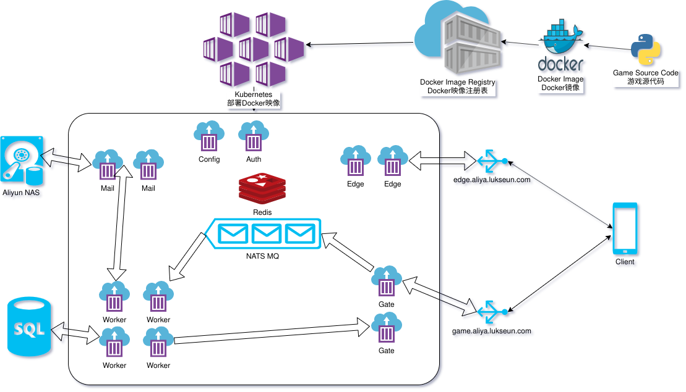

# Server Structure

The goal of this document is to describe the structure and operation of the Lukseun Server System.
This guide will attempt to cover everything from code design to Kubernetes administration.

**Table of Contents**
* [Introduction](#Introduction)
* [A Trip Through the Server](#Trip-Through-the-Server)
* [Technology](#Technology)
* [General Code Guidelines](#General-Code-Guidelines)
* [Services](#Services)
	* [Auth](#Auth)
	* [Config](#Config)
	* [Edge](#Edge)
	* [Gate](#Gate)
	* [Mail](#Mail)
	* [Worker](#Worker)
		* [worker.py](#workerpy)
		* [message_handler.py](#message_handlerpy)
		* [module](#module)
* [Docker](#Docker)
* [Kubernetes](#Kubernetes)

## Introduction

The basic design philosophy followed is a highly scalable **micro-service** architecture.
The goal of each **service** is to be **stateless**, giving each service the flexibility to **scale horizontally** without any configuration changes required.
Additionally, each service should only be responsible for one thing.
If a service is responsible for creating and verifying login tokens, it should not also process any game data.
For example, this would let us have 5 replicas of a service responsible for game data, and only 1 replica of a service responsible for login tokens.
In this way, we have more control over how we distribute our computing resources, and would not be possible if everything was on a single server.
This separation of responsibilities is exactly what gives micro-services their strength.

To deploy our micro-services, we rely on the power of **Docker** and **Kubernetes**.
Docker provides a convenient way to package and run our programs.
Kubernetes provides the orchestration, deployment, and automatic scaling functions of our Docker images.

## Trip Through the Server

Take a look at the diagram up above.
Let's pretend we are a non-chat message being sent from the client's phone to our system.

After being sent, the first thing we will hit is the load balancer attached to `game.aliya.lukseun.com`.
The load balancer will then send us off to a random gate.
The gate will, after performing some basic accounting operations, push us into the message queue.
We will stay in the message queue until an available worker is able to accept us.
The worker will then perform the actual work required to complete the request.
This might involve querying the MySQL database for information, or requesting mail from the mail servers.
After the operation is complete, we will be sent back to the original gate we entered through.
The gate will then tidy up, and forward us back to the client.
All of this typically happens within the span of `10 ms`.

Again, lets pretend we are a message, except this time, we are a chat message.
The client app will send a special message to `edge.aliya.lukseun.com`, attempting to join the chat server.
The load balancer at `edge.aliya.lukseun.com` will route our message to one of the edge nodes.
This establishes a persistent TCP connection between client and edge node that will not change for the duration the client is connected.
Messages flow freely back and forth between the edge node and the client.

## Technology

There are several servers we use in our system that we did not make.
Many of these servers are industry standards, so they have excellent documentation.
Here is a brief description of the servers we use.

* Redis
* Nats
* MySQL

## General Code Guidelines

The requirements of specific responsiblity, and statelessness affect the way we design and write our code.
Each service has its own directory.
Everything relating to that service should be put in that directory and nothing else.
Some examples of valid items: code, extra required files, requirements.txt.
Any items relating to other services should *not* be in this directory.
In addition to the aforementioned items, there should also be a **Dockerfile** included in each service directory.

When we design a service, we need to think about how to make it stateless.
In the first design of the chat server, each chat server was bound to a single world.
Any client that was on World 1 could only connect to the chat server for World 1.
This design had several problems.
First, we needed to start one chat server for each world, even if no one was on that world.
Second, if many people were on the same world, there was no way we could add more servers to help.
This is an example of a design that is not stateless. 

All code should have options specifiable via command line arguments.

## Services

Contains specific documentation relating to each micro-service.

### Auth

Issues and validates client login tokens.
Registers and redeems **nonces**.
API is exposed via HTTP POST endpoints.

Client login tokens are created according to the JWT standard.
They are signed using a secret value specified to the auth server via command line argument.
The tokens contain the client's unique id.

Nonces can be registered and redeemed.
A key (nonce) is associated with a payload.
Both the key and the payload are specified by the caller.
Stores the key and payload in Redis.
Any auth server can retrieve the key even if they didn't register it.
The key and payload are removed from Redis after once they have been retrieved.

### Config

A simple HTTP server which is responsible for hosting configuration files used by other services.
Periodically re-reads the files from disk so as to ensure the latest version is always being provided.

### Edge

Simple chat server.
Handles clients from different worlds.
Clients provide a nonce upon connecting, much like a login token.
Redis is then queried for the nonce.
The nonce's payload contains the client's game name, world, and family information.
If a valid nonce was supplied, the client can chat normally, otherwise close the connection.

The chat server follows a simple protocol.
All messages contain a left-zero-padded string of length 10 (called the command), followed by an optional payload, followed by `\r\n`.
The expected payload changes depending upon the command.
If the protocol is ever not followed by the client, immediately close the connection.

Edge servers use Nats as a **pub-sub** server, to distribute messages across edge nodes.
Public chat messages are published to **chat.$WORLD.public** channel, where **$WORLD** is the world number.
Family chat messages are published to **chat.$WORLD.family.$FN** channel, where **$WORLD** is the world number and **$FN** is the name of the family.

Consequently, any one subscribing to the **chat.>** channel will be able to receive every message sent in the chat system.
This behavior makes it very convenient to log all chat messages.

Edge servers subscribe to the proper pub-sub channels depending upon the clients which are connected to it.
Once an edge server receives a message on a subscribed channel, it forwards that message to all connected clients which are interested in that channel.

### Gate

The client facing entrance point into the game servers.
Accepts a single message from the client, pushes that message onto the message queue, and waits for the response.

When the gate first starts, it creates a network unique gate id.
No two gates can have the same id.
It then uses Redis to associate its gate id with its IP address.
It uses the Redis key **gates.id.$GID** where **$GID** is the unique gate id.
The gate will periodically send messages to Redis, signalling that this gate id is still operating well.

The gate is actually running two TCP servers at the same time.
The first server is the client server, which operates on port 8880 by default.
The client server implements the following logic.

When the gate receives a message from the client, it generates a unique id used to keep track of the message.
The gate maintains a dictionary who's keys are message ids, and the values are client sockets.
The gate also uses Redis to associate the message id with the gate id of the gate.
The client message is then packaged together with the message id, and pushed to the Nats message queue.
At this point, the gate waits for the response.

After the response has been forwarded to the client, the gate performs some cleanup.
The gate removes the message id and client socket from its dictionary.
The Redis entry created with the message id and the gate id is automatically deleted after 10 seconds.

The second server is the "worker" server, which operates on port 8201 by default.
This server is used by workers to send responses back to the gate.

Its job is quite simple: wait for message responses to arrive from the workers.
When a response arrives from a worker, it has both the message id, and the actual response.
The message id is read, and used to lookup which client socket to forward the response to.
The response is then forwarded to the client socket directly.
The client socket is then closed.

### Mail

Responsible for creating and retrieving all in-game mail.
The mail system is at the core of many systems in the game.
It allows players to send friend and family requests, as well as send gifts.

The mail server exposes a simple yet capable API via HTTP POST requests.

Mail is saved on disk using the standard **Maildir** format.
Each piece of mail is a single file.
Each world has a mail folder.
Within each world folder, there are folders for each unique id.
Within each unique id folder, are three automatically created folders (cur, new, tmp).
These folders are part of the Maildir specification.
The individual pieces of mail are contained within those three folders.

When a piece of mail is created, it is assigned a unique key which is generated by the mail server.

The Maildir format requires that the on-disk message representation contain only ascii characters.
To circumvent this limitation, all values that have the potential to contain non-ascii characters are encoded before being stored on disk.
These values are always de-encoded before being sent back to the client.

In testing environments, it is okay to store mail in a folder locally.
However, in production, the mail server should store mail in something like a NAS.
In this way, if the machine running the mail server encounters an error, no mail is lost.

### Worker

Responsible for performing the work requested by the client and returning the result back to the correct gate.
The worker is comprised of a few distinct parts, and each one will be described in detail.

#### worker.py

The entrypoint to the worker service.
Provides a framework to accept messages from Nats, work on them, and return them back.
Initializes all cofigurations, and establishes all network connections needed to complete work.
MySQL connection pools are established at this level, as well as a Redis and Nats connection.
An HTTP Client Connection Pool is also created, which is used to communicate with the other services operating via HTTP.

Connects to the Nats Message Queue and awaits jobs to come on the queue.
When a job comes, it contains the message id as well as the message sent from the client.
The worker separates the message id from the message, and submits the message to the message\_handler for processing.
Once as result has been obtained, the message id is used to query Redis for the gate id of the gate containing the client.
If a TCP connection to that gate's worker server has not already been established, a new connection will be made.
Sends the message id along with the response back to the correct gate.

#### message\_handler.py

Responsible for parsing the job.
Validates the supplied token (if required), and calls the correct function.
If the token can not be verified, returns and error to the client.
If the function passed by the client is not valid, returns an error.
All other un-caught exceptions get returned to the client as "programming error".

After verifiying the token, and finding the correct function in the Function List (a dictionary), it calls the function.
The logic for the function is found in the individual modules located in the `module` directory.

#### module

A directory containing code responsible for handling game-related logic.
Also refers to the individual source code files found in this folder.

Each source code file in this directory contains functions which are closely related.
Functions pertaining to family things should be written in the family module.
The family module should then *not* contain logic related to the weapon system.

Each module is written using the **functional programming** style.
The modules do not contain classes, rather individual functions designed to complete a single task only.

These functions should be broken up into smaller, logically coherent helper functions.
This helps improve readability.

Something to note is the extensive use of the `**kwargs` argument.
This argument contains many helpful tools the function might like to use.
These tools could be a database connection, redis connection, or an http client.
Additionally, configuration files can be found in the `**kwargs` argument.
These can be accessed via `kwargs['config'][ ... ]`.
You can reference the message\_handler's `resolve` function, which populates this `**kwargs` parameter, to find all the goodies it contains.
Ultimately, the kwargs parameter allows the programmer to have the convenience of always having access to commonly shared resources.
And eliminates the clutter of re-declaring network connections and config files everywhere.

Some unique modules declared are `common.py` and `enums.py`.
`common.py` contains commonly used functions.
Examples of these functions are database execution functions, and resolving uids to game names.
Do not put non-generic functions in this module.

`enums.py` defines a set of enums used by the entire server system.
These enums are also the same ones used by the client app.
The MySQL database makes extensive use of these enum values as composite keys.
This is because hashing and comparing int values is significantly faster than string values.
Use this module to define symbolic representations of items, roles, skills in the game.

## Docker

Our micro-service architecture demands an easy way to distribute and deploy our many servers.
With multiple servers, each with their own set of required third-party libraries, things can get out of hand quickly.
Fortunately, Docker provides us with an easy solution to all of that: Docker images.

You can think of a Docker image like a very simple Virtual Machine.
It provides an isolated environment for you to run your code in.
It contains all of the required third-party libraries needed to run your server, in addition to your code.
This image can then be run from any machine that can run Docker.

To create a Docker image, you need a Dockerfile.
A Dockerfile is like a recipe for the steps needed to create your perfect isolated environment.
You write instructions in the Dockerfile for how you would like to setup your "little virtual machine".
Extensive documentation can be found online for how to create a Dockerfile.

Once you have your Dockerfile created, you need to actually build the Docker image.
On linux, you can do that via the `docker build` command.
However, simplying building the docker image is not that helpful to us.
We want to both build the image, and publish it in a place that is easily accessible (you will see why later).

We will be using Aliyun's Container Registry service as a location to host our Docker images.
You can find information about this on Aliyun's website.
When building the images, you will need to tag them appropriately to be pushed to Aliyun's Registry.
For example, if I was building the Docker image for the gate service, I would issue a command like this:
`docker build -t registry.cn-hangzhou.aliyuncs.com/lukseun/gate:latest .`
to build the image.
Afterwards, I could issue:
`docker push registry.cn-hangzhou.aliyuncs.com/lukseun/gate:latest`
to push the built image to Aliyun's Registry.

Once the Docker images for our services have been built and pushed onto Aliyun's Registry, we need a method of deploying them.

## Kubernetes

Kubernetes, also know as K8S, is a service that will deploy and manage our micro-services.
It does this using the Docker images we have created and pushing to Aliyun.

There is extensive documentation online regarding the use and administration of kubernetes.
As such, this section will be left rather short, in favor of other documentation.
However, an excellent interactive tutorial can be found here: [Tutorial](https://kubernetes.io/docs/tutorials/kubernetes-basics/)

In general, we will want to create a Kubernetes Deployment for each micro-service.
For each of these deployments, we will want to create an internally load-balanced Kubernetes Service.
Each of our micro-services should reference the Kubernetes Service address if they need to communicate with another service.

Additionally, we will want to create externally load-balanced Kubernetes Services for the `edge` and `gate` deployments, as these are the only client facing servers.

We should assign public domain names (such as edge.aliya.lukseun.com) to each client facing load-balanced service.
The client app should use these domain names when connecting to our server.

