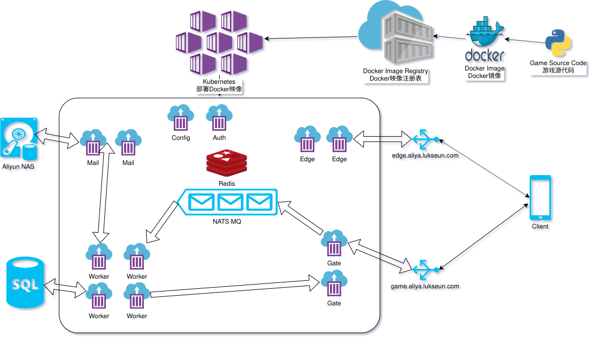

# 服务器架构

此文档的目的用于描述Lukseun Server System的架构和操作方法，文档会尽可能包含所有关于Kubernetes的管理与代码编写。

**目录**

* [介绍](#介绍)
* [服务器快速入门](#服务器快速入门)
* [技术点](#技术点)
* [通用代码入门](#通用代码入门)
* [服务器模块](#服务器模块)
	* [Auth](#Auth)
	* [Config](#Config)
	* [Edge](#Edge)
	* [Gate](#Gate)
	* [Mail](#Mail)
	* [Worker](#Worker)
		* [worker.py](#workerpy)
		* [message_handler.py](#message_handlerpy)
		* [module](#module)
* [Docker](#Docker)
* [Kubernetes](#Kubernetes)

## 介绍

服务器设计的理念遵循**微型**高度可弹性伸缩结构。

每一个微型服务器初始为无状态，服务器会根据情况进行自动扩张，全程不需要做配置修改。

另外，每一个微型服务器都只服务一个项目。

如果一个微形服务器的功能是创建帐号或者验证登陆，他就不会做对方服务器的任务。

比如：目前我们有5个微形服务器处理游戏数据，只有其中一个会处理微型服务器会处理登陆任务。

这样的话我们可以更好分发和处理资源，就不会让所有的资源都在一台服务器上。

所以微型服务器的处理责任分发能力是最合适的。

为了实现我们的微形服务器结构，我们采用了**docker**和**kubernetes**技术。

**docker**可以给我们的服务器提供最方便的打包技术。

**Kubernetes**可以给我们的**docker**镜像提供配置器，部署和自动伸缩的功能

## 服务器快速入门

参考如上示例图。

我们现在假象我们的服务器没有聊天系统的消息处理。

在所有消息发送到服务器处理之前，所有的消息会发送到负载均衡服务器 `game.aliya.lukseun.com`。

负载均衡服务器随机发送到我们的gate服务器。

gata服务器在处理完部分账户操作之后，会把消息推送到message queue服务器。

message queue的的消息队列会一直等待相应的woker服务器来接收消息。

woker服务器会处理具体的逻辑然后返回结果，其中可能也会做数据库服务器操作和邮箱服务器操作。

在所有操作处理完毕之后，会返回给消息来源的gate服务器。

gate整理好收到的消息后，在返回给客户端。

整个流程大约在`10ms`左右。

现在让我们来假设整个流程，抛开时间因素，我现在是一个消息。

客户端会发送消息到`edge.aliya.lukseun.com`以加入聊天服务器。

在`edge.aliya.lukseun.com`的负载均衡的服务器会把消息分发到其中一个edge服务器结点。

之后会在客户端和服务器创立一个持续性的tcp连接，edge服务器不会在连接期间做任何改变。

消息流会自由的在客户端和edge服务器之间进行来往。

## 技术点

这里面有部分技术是我们文档没有提到的。

他们大部分都是标准化的技术而且官方提供非常专业的文档。

如下所示:

* Redis
* Nats
* MySQL

## 通用代码入门

责任分明和无差别区分思想是我们设计程序的主要思路。

每一个功能模块都有自己的目录

所有和此功能相关的文件都应该放在这个目录。

比如：代码，关联库和python安装库。

再次强调，不要把无关文件放入到模块的目录中。

另外在每个模块文件夹中，也必须要包含**Dockerfile**

当我们设计服务器的时候，我们首先考虑的是无差别性。

我们刚开始设计聊天系统的时候，每一个世界都有一个聊天系统。

如果这个聊天系统属于世界1就只能连接世界1的服务器。

这样的设计有几个问题。

首先，我们需要给每一个世界创建一个聊天服务器，不管是否有人在这个聊天服务器。

其次，如果一个聊天服务器特别繁忙，我们没有办法让其他服务器来帮忙分流。

这样的设计就叫无差别性。

所有的代码都有特定的地方填写参数来配置不同的功能。   

## 服务器模块

如下每一项介绍都关联对应的微型服务器。

### Auth

反馈登陆的合法性和验证结果。

注册和使用**nonces**。

API通过http post进行点对点传输。

服务器登陆的token遵循JWT标准。

他们会用命令行参数进行注册，注册码会用特别的加密值来进行标记。

token会包含用户的unique id。

nonces可以被注册，也可以被兑换。

因此nonces是唯一用来和服务器交互的关键

nonces和交互服务器标识都被caller函数定义。

nonces和交互服务器标识都在Redis中存储。

任何auth服务器都可以检索nonces关键字甚至他们并没有被Redis注册。

一旦nonces和交互服务器标识被检索，他们会立即从Redis中移除。

### Config

一个简单的http服务器，用于返回服务器所使用的配置文件信息。

他会周期性的从本地文件中读取配置文件，以用于确保使用最新的版本。

### Edge

这是一个简单的聊天服务器。

处理客户端连上不同世界的聊天服务器。

客户端提供nonce来连接聊天服务器，和登陆的token是一个道理。

Redis用nonce作为关键字来查询。

交互服务器标识包含了服务器的名字，世界和家族信息。

如果是合法的nonce，客户端可以直接聊天，否则会直接关闭连接。

聊天系统遵循simple protocol规则。

所有消息的前10位是命令集，结尾由`\r\n`

If a valid nonce was supplied, the client can chat normally, otherwise close the connection.

The chat server follows a simple protocol.
All messages contain a left-zero-padded string of length 10 (called the command), followed by an optional payload, followed by `\r\n`.
The expected payload changes depending upon the command.
If the protocol is ever not followed by the client, immediately close the connection.

Edge servers use Nats as a **pub-sub** server, to distribute messages across edge nodes.
Public chat messages are published to **chat.$WORLD.public** channel, where **$WORLD** is the world number.
Family chat messages are published to **chat.$WORLD.family.$FN** channel, where **$WORLD** is the world number and **$FN** is the name of the family.

Consequently, any one subscribing to the **chat.>** channel will be able to receive every message sent in the chat system.
This behavior makes it very convenient to log all chat messages.

Edge servers subscribe to the proper pub-sub channels depending upon the clients which are connected to it.
Once an edge server receives a message on a subscribed channel, it forwards that message to all connected clients which are interested in that channel.

### Gate

The client facing entrance point into the game servers.
Accepts a single message from the client, pushes that message onto the message queue, and waits for the response.

When the gate first starts, it creates a network unique gate id.
No two gates can have the same id.
It then uses Redis to associate its gate id with its IP address.
It uses the Redis key **gates.id.$GID** where **$GID** is the unique gate id.
The gate will periodically send messages to Redis, signalling that this gate id is still operating well.

The gate is actually running two TCP servers at the same time.
The first server is the client server, which operates on port 8880 by default.
The client server implements the following logic.

When the gate receives a message from the client, it generates a unique id used to keep track of the message.
The gate maintains a dictionary who's keys are message ids, and the values are client sockets.
The gate also uses Redis to associate the message id with the gate id of the gate.
The client message is then packaged together with the message id, and pushed to the Nats message queue.
At this point, the gate waits for the response.

After the response has been forwarded to the client, the gate performs some cleanup.
The gate removes the message id and client socket from its dictionary.
The Redis entry created with the message id and the gate id is automatically deleted after 10 seconds.

The second server is the "worker" server, which operates on port 8201 by default.
This server is used by workers to send responses back to the gate.

Its job is quite simple: wait for message responses to arrive from the workers.
When a response arrives from a worker, it has both the message id, and the actual response.
The message id is read, and used to lookup which client socket to forward the response to.
The response is then forwarded to the client socket directly.
The client socket is then closed.

### Mail

Responsible for creating and retrieving all in-game mail.
The mail system is at the core of many systems in the game.
It allows players to send friend and family requests, as well as send gifts.

The mail server exposes a simple yet capable API via HTTP POST requests.

Mail is saved on disk using the standard **Maildir** format.
Each piece of mail is a single file.
Each world has a mail folder.
Within each world folder, there are folders for each unique id.
Within each unique id folder, are three automatically created folders (cur, new, tmp).
These folders are part of the Maildir specification.
The individual pieces of mail are contained within those three folders.

When a piece of mail is created, it is assigned a unique key which is generated by the mail server.

The Maildir format requires that the on-disk message representation contain only ascii characters.
To circumvent this limitation, all values that have the potential to contain non-ascii characters are encoded before being stored on disk.
These values are always de-encoded before being sent back to the client.

In testing environments, it is okay to store mail in a folder locally.
However, in production, the mail server should store mail in something like a NAS.
In this way, if the machine running the mail server encounters an error, no mail is lost.

### Worker

Responsible for performing the work requested by the client and returning the result back to the correct gate.
The worker is comprised of a few distinct parts, and each one will be described in detail.

#### worker.py

The entrypoint to the worker service.
Provides a framework to accept messages from Nats, work on them, and return them back.
Initializes all cofigurations, and establishes all network connections needed to complete work.
MySQL connection pools are established at this level, as well as a Redis and Nats connection.
An HTTP Client Connection Pool is also created, which is used to communicate with the other services operating via HTTP.

Connects to the Nats Message Queue and awaits jobs to come on the queue.
When a job comes, it contains the message id as well as the message sent from the client.
The worker separates the message id from the message, and submits the message to the message\_handler for processing.
Once as result has been obtained, the message id is used to query Redis for the gate id of the gate containing the client.
If a TCP connection to that gate's worker server has not already been established, a new connection will be made.
Sends the message id along with the response back to the correct gate.

#### message\_handler.py

Responsible for parsing the job.
Validates the supplied token (if required), and calls the correct function.
If the token can not be verified, returns and error to the client.
If the function passed by the client is not valid, returns an error.
All other un-caught exceptions get returned to the client as "programming error".

After verifiying the token, and finding the correct function in the Function List (a dictionary), it calls the function.
The logic for the function is found in the individual modules located in the `module` directory.

#### module

A directory containing code responsible for handling game-related logic.
Also refers to the individual source code files found in this folder.

Each source code file in this directory contains functions which are closely related.
Functions pertaining to family things should be written in the family module.
The family module should then *not* contain logic related to the weapon system.

Each module is written using the **functional programming** style.
The modules do not contain classes, rather individual functions designed to complete a single task only.

These functions should be broken up into smaller, logically coherent helper functions.
This helps improve readability.

Something to note is the extensive use of the `**kwargs` argument.
This argument contains many helpful tools the function might like to use.
These tools could be a database connection, redis connection, or an http client.
Additionally, configuration files can be found in the `**kwargs` argument.
These can be accessed via `kwargs['config'][ ... ]`.
You can reference the message\_handler's `resolve` function, which populates this `**kwargs` parameter, to find all the goodies it contains.
Ultimately, the kwargs parameter allows the programmer to have the convenience of always having access to commonly shared resources.
And eliminates the clutter of re-declaring network connections and config files everywhere.

Some unique modules declared are `common.py` and `enums.py`.
`common.py` contains commonly used functions.
Examples of these functions are database execution functions, and resolving uids to game names.
Do not put non-generic functions in this module.

`enums.py` defines a set of enums used by the entire server system.
These enums are also the same ones used by the client app.
The MySQL database makes extensive use of these enum values as composite keys.
This is because hashing and comparing int values is significantly faster than string values.
Use this module to define symbolic representations of items, roles, skills in the game.

## Docker

Our micro-service architecture demands an easy way to distribute and deploy our many servers.
With multiple servers, each with their own set of required third-party libraries, things can get out of hand quickly.
Fortunately, Docker provides us with an easy solution to all of that: Docker images.

You can think of a Docker image like a very simple Virtual Machine.
It provides an isolated environment for you to run your code in.
It contains all of the required third-party libraries needed to run your server, in addition to your code.
This image can then be run from any machine that can run Docker.

To create a Docker image, you need a Dockerfile.
A Dockerfile is like a recipe for the steps needed to create your perfect isolated environment.
You write instructions in the Dockerfile for how you would like to setup your "little virtual machine".
Extensive documentation can be found online for how to create a Dockerfile.

Once you have your Dockerfile created, you need to actually build the Docker image.
On linux, you can do that via the `docker build` command.
However, simplying building the docker image is not that helpful to us.
We want to both build the image, and publish it in a place that is easily accessible (you will see why later).

We will be using Aliyun's Container Registry service as a location to host our Docker images.
You can find information about this on Aliyun's website.
When building the images, you will need to tag them appropriately to be pushed to Aliyun's Registry.
For example, if I was building the Docker image for the gate service, I would issue a command like this:
`docker build -t registry.cn-hangzhou.aliyuncs.com/lukseun/gate:latest .`
to build the image.
Afterwards, I could issue:
`docker push registry.cn-hangzhou.aliyuncs.com/lukseun/gate:latest`
to push the built image to Aliyun's Registry.

Once the Docker images for our services have been built and pushed onto Aliyun's Registry, we need a method of deploying them.

## Kubernetes

Kubernetes, also know as K8S, is a service that will deploy and manage our micro-services.
It does this using the Docker images we have created and pushing to Aliyun.

There is extensive documentation online regarding the use and administration of kubernetes.
As such, this section will be left rather short, in favor of other documentation.
However, an excellent interactive tutorial can be found here: [Tutorial](https://kubernetes.io/docs/tutorials/kubernetes-basics/)

In general, we will want to create a Kubernetes Deployment for each micro-service.
For each of these deployments, we will want to create an internally load-balanced Kubernetes Service.
Each of our micro-services should reference the Kubernetes Service address if they need to communicate with another service.

Additionally, we will want to create externally load-balanced Kubernetes Services for the `edge` and `gate` deployments, as these are the only client facing servers.

We should assign public domain names (such as `edge.aliya.lukseun.com`) to each client facing load-balanced service.
The client app should use these domain names when connecting to our server.

